<div align="center">
  <h1>🚀 The Ultimate WebSocket Guide</h1>
  <p><em>A comprehensive, structured reference for building real-time applications</em></p>
  
  
  
</div>

<br/>

<details open>
  <summary><b>📖 Table of Contents</b></summary>
  <ul>
    <li><a href="#-1-core-concepts-what-is-a-websocket">Core Concepts (What is a WebSocket?)</a></li>
    <li><a href="#-2-the-websocket-lifecycle">The WebSocket Lifecycle</a></li>
    <li><a href="#-3-implementation-patterns">Implementation Patterns (Async/Await vs Callbacks)</a></li>
    <li><a href="#-4-resilience--error-handling">Resilience & Error Handling</a></li>
    <li><a href="#-5-advanced-features">Advanced Features (Rooms, Auth, Binary Data)</a></li>
    <li><a href="#-6-scaling--architecture">Scaling & Architecture (Redis)</a></li>
    <li><a href="#-7-websockets-vs-alternatives">WebSockets vs Alternatives (SSE, Polling)</a></li>
    <li><a href="#-8-project-demo-overview">Project Demo Overview</a></li>
  </ul>
</details>

<br/>

---

## 📌 1. Core Concepts: What is a WebSocket?

WebSockets provide a continuous, **full-duplex** communication channel over a single TCP connection.

| Feature | 🌐 HTTP (REST) | ⚡ WebSocket |
| :--- | :--- | :--- |
| **Analogy** | 📬 Sending a letter & waiting for a reply | 📞 An ongoing phone call |
| **Connection** | Opens & closes per request | Stays **OPEN** continuously |
| **Direction** | One-way (Client asks, Server answers) | Two-way (Full-duplex, simultaneous) |
| **Server Push?** | ❌ No (Server cannot initiate) | ✅ Yes (Server can send anytime) |
| **Overhead** | High (Headers sent every time) | Low (Minimal framing after handshake) |
| **Best For** | CRUD apps, APIs, fetching static pages | Chat, live dashboards, multiplayer games |

> 💡 **Golden Rule**: If your application requires data to update "live" without the user refreshing the page, **use WebSockets**.

---

## 🔄 2. The WebSocket Lifecycle

Every WebSocket connection follows a strict 4-step lifecycle:

```mermaid
graph LR
A(🤝 CONNECT) --> B(✅ OPEN)
B --> C(💬 SEND/RECEIVE)
C --> D(📵 CLOSE)
```



<h3><kbd>Step 1</kbd> Connect</h3>

```javascript
// Connect to a WebSocket server (usually wss:// in production)
const ws = new WebSocket('ws://localhost:8082');
```

<h3><kbd>Step 2</kbd> Open</h3>

```javascript
// Fired when the connection is successfully established
ws.addEventListener('open', () => {
  console.log('✅ Connected to server!');
});
```

<h3><kbd>Step 3</kbd> Send & Receive</h3>

```javascript
// Sending data to the server
ws.send(JSON.stringify({ type: 'greeting', payload: 'Hello Server!' }));

// Receiving data from the server
ws.addEventListener('message', (event) => {
  const data = JSON.parse(event.data);
  console.log('💬 Server says:', data);
});
```

<h3><kbd>Step 4</kbd> Close & Error Handling</h3>

```javascript
// Manually close the connection
ws.close();

// Listen for disconnections
ws.addEventListener('close', (event) => {
  console.log(`📵 Disconnected. Clean: ${event.wasClean}, Code: ${event.code}`);
});

// Listen for errors
ws.addEventListener('error', (error) => {
  console.error('❌ Connection error:', error);
});
```

---

## 💻 3. Implementation Patterns

When handling asynchronous operations over WebSockets, modern JavaScript prefers **Async/Await** over traditional **Callbacks**.

<details>
<summary><b>❌ Callbacks (The Old Way)</b></summary>

Causes "Callback Hell" (deep nesting) and makes error handling tedious.
```javascript
function processData(data, callback) {
  setTimeout(() => callback(null, { result: data }), 600);
}

processData("hello", (err, result) => {
  if (err) return console.error(err);
  console.log(result); 
});
```
</details>

<details open>
<summary><b>✅ Async/Await (The Modern Way)</b></summary>

Reads top-to-bottom, flattening the nesting and standardizing error handling via `try/catch`.
```javascript
async function handleMessage(data) {
  try {
    const result = await processDataPromise(data); // Pauses without blocking
    console.log('Processed:', result);
  } catch (err) {
    console.error("Error processing data:", err);
  }
}
```
</details>

---

## 🛡️ 4. Resilience & Error Handling

Connections *will* fail in the real world due to network drops, server restarts, or load balancer timeouts.

### ♻️ Auto-Reconnect with Exponential Backoff
Never reconnect instantly in an infinite loop. Use exponential backoff to gradually increase the wait time between retry attempts.

```javascript
let ws;
let retries = 0;
const MAX_RETRIES = 8;
let retryTimer = null;

function connect() {
  ws = new WebSocket('ws://localhost:8082');

  ws.addEventListener('open', () => {
    console.log('✅ Connected');
    retries = 0; // 🎯 Reset counter on success
    clearTimeout(retryTimer);
  });

  ws.addEventListener('close', (event) => {
    // 1000 is a deliberate, clean closure. Don't auto-reconnect.
    if (event.code === 1000) return; 
    
    if (retries >= MAX_RETRIES) {
      console.log('❌ Max retries reached. Please refresh.');
      return;
    }

    // 📈 Exponential Backoff: 1s, 2s, 4s, 8s... capped at 30s
    const delay = Math.min(1000 * (2 ** retries), 30000);
    console.log(`♻️ Reconnecting in ${delay/1000}s...`);
    
    retries++;
    retryTimer = setTimeout(connect, delay);
  });
}

connect();
```

### ❤️ Heartbeats (Ping/Pong)
Load balancers automatically kill connections that are entirely silent for a period (e.g., AWS ALB = 60s). Keep it alive with a heartbeat.

```javascript
let pingTimer, pongTimer;

function startHeartbeat(ws) {
  // Ping the server every 30 seconds
  pingTimer = setInterval(() => {
    ws.send('ping');
    
    // Expect a 'pong' back within 10 seconds, else drop connection
    pongTimer = setTimeout(() => ws.close(), 10000); 
  }, 30000); 
}

ws.addEventListener('message', (e) => {
  if (e.data === 'pong') clearTimeout(pongTimer); // Server is alive!
});

// Always clean up on close
ws.addEventListener('close', () => {
  clearInterval(pingTimer);
  clearTimeout(pongTimer);
});
```

---

## 🔧 5. Advanced Features

### 📡 5.1 Broadcasting & Rooms
- **Broadcasting:** Sending a message to *everyone* connected.
- **Rooms/Channels:** Grouping sockets to send messages to specific subsets.

```javascript
// Server-side: Broadcasting to everyone except the sender
wss.on('connection', (ws) => {
  ws.on('message', (msg) => {
    wss.clients.forEach((client) => {
      if (client !== ws && client.readyState === WebSocket.OPEN) {
        client.send(msg);
      }
    });
  });
});
```

### 🔐 5.2 Authentication (JWT)
The native browser `WebSocket` API does not allow custom HTTP headers. Therefore, authentication usually happens via the URL query string.

```javascript
// Client
const ws = new WebSocket(`wss://api.example.com?token=${myJwtToken}`);

// Server
wss.on('connection', (ws, req) => {
  const urlParams = new URLSearchParams(req.url.split('?')[1]);
  const token = urlParams.get('token');
  
  if (!verifyToken(token)) {
    ws.close(4001, 'Unauthorized'); // Custom close code
    return;
  }
});
```
> ⚠️ **Security Warning**: Always use `wss://` (WebSocket Secure) if passing tokens via URL query parameters so they remain encrypted in transit!

### 🗃️ 5.3 Binary Data
WebSockets aren't just for text. You can send raw bytes (`ArrayBuffer` or `Blob`).

```javascript
// Set binary type before processing
ws.binaryType = 'arraybuffer';

// Sending a file chunk
const buffer = await file.arrayBuffer();
ws.send(JSON.stringify({ type: 'sending-file', name: file.name })); // Meta first
ws.send(buffer); // Raw bytes second
```

---

## 🌍 6. Scaling & Architecture

A single Node.js WebSocket server can generally handle 10k–50k concurrent connections. But if you have multiple server instances behind a load balancer, clients on Server A cannot see messages sent by Server B.

**Solution: Redis Pub/Sub Architecture**

<div align="center">
<pre>
    🌐 Load Balancer 
      ↗         ↘
 🖥️ Server A   🖥️ Server B
      ↘         ↙
   🧱 Redis Pub/Sub
</pre>
</div>

1. **Publisher:** When Server A receives a message, it publishes it to Redis.
2. **Subscriber:** All servers (A, B...) subscribe to the Redis channel.
3. **Broadcaster:** Redis forwards the message to all servers, which then broadcast to their local clients.

---

## ⚖️ 7. WebSockets vs Alternatives

| Feature | `ws://` WebSocket | Server-Sent Events (SSE) | Long Polling |
| :--- | :--- | :--- | :--- |
| **Flow** | 🔀 Two-way | ⬇️ Server → Client | 🔄 Fake Two-way |
| **Native Reconnect**| ❌ Manual | ✅ Built-in | ❌ No |
| **Binary Support** | ✅ Yes | ❌ Text only | ⚠️ Base64 encoded |
| **Use Case** | Chat, Games | Live Feeds, ChatGPT | Legacy fallback |

---

## 📁 8. Project Demo Overview

The project backend contains demonstrations for all the concepts mentioned above. 

Start the server:
```bash
node server.js
```

Then open these files to learn:

| File | Lesson Focus |
| :--- | :--- |
| 🏠 `index.html` | Home Hub — Navigates to all lessons |
| 🟢 `learn.html` | **Lesson 1:** WebSocket Basics |
| 🔄 `learn3.html` | **Lesson 3:** Callbacks vs Async/Await |
| 🛡️ `learn5.html` | **Lesson 5:** Error Handling & Auto-Reconnect |
| 🔐 `learn8.html` | **Lesson 8:** Authentication |
| 🚀 `learn11.html`| **Lesson 11:** Scaling WebSockets |
| 🤖 `client.html` | **Advanced Demo:** Operational concepts combined |

<br/>

<div align="center">
  <p><i>Generated for maximum readability, structure, and aesthetic precision.</i></p>
</div>
